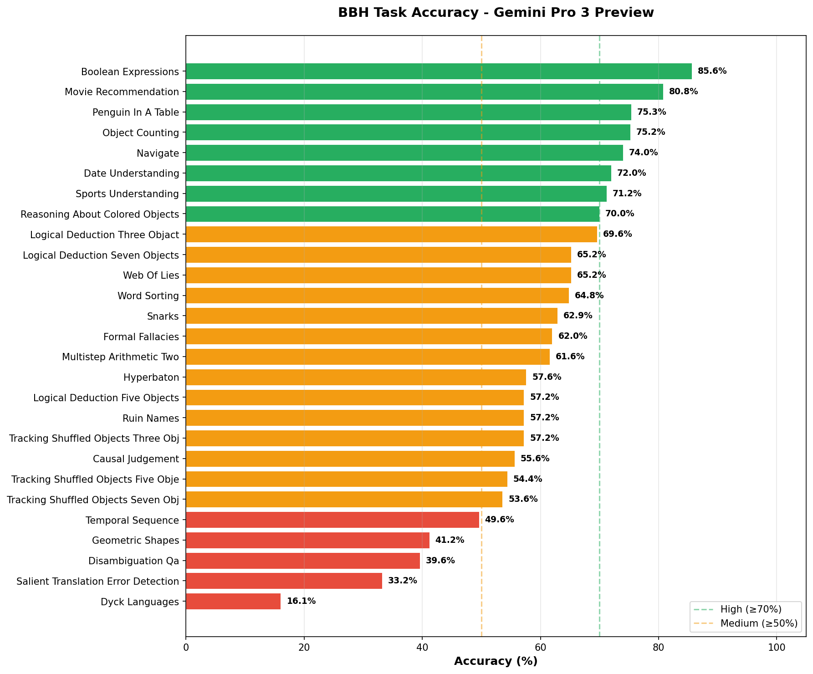
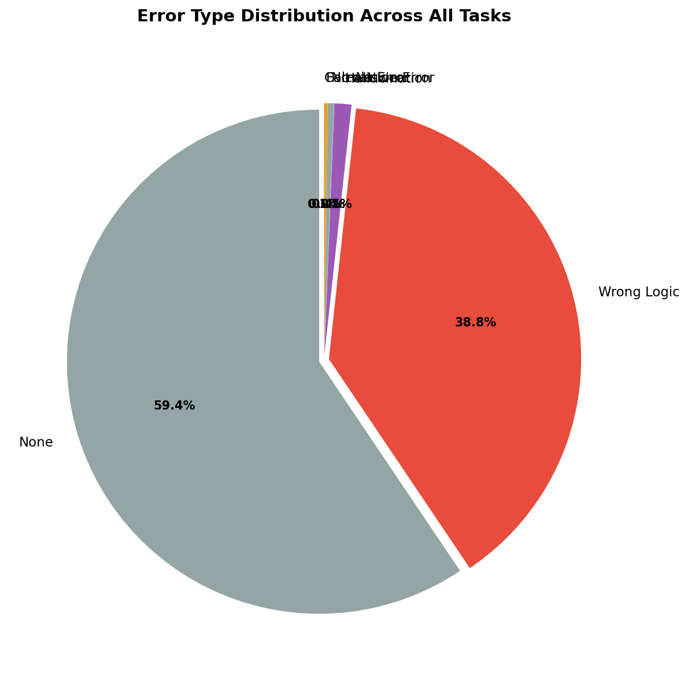
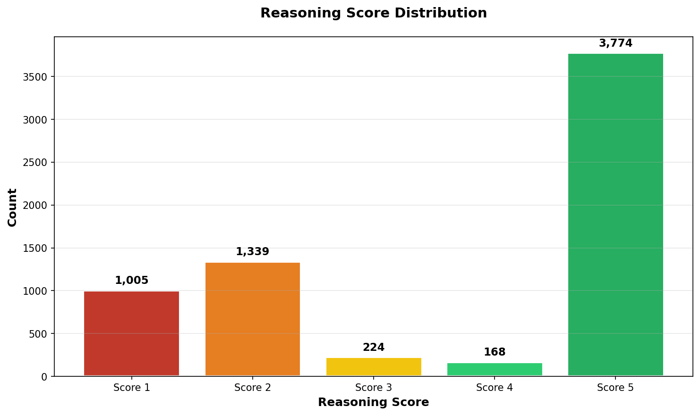
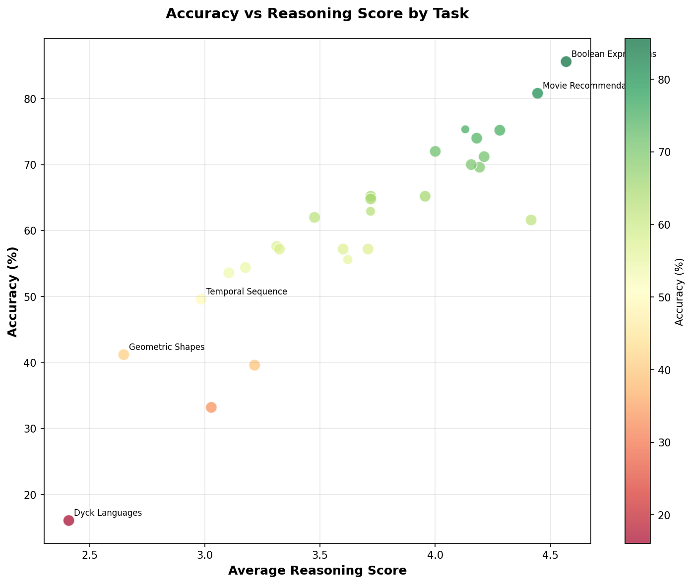
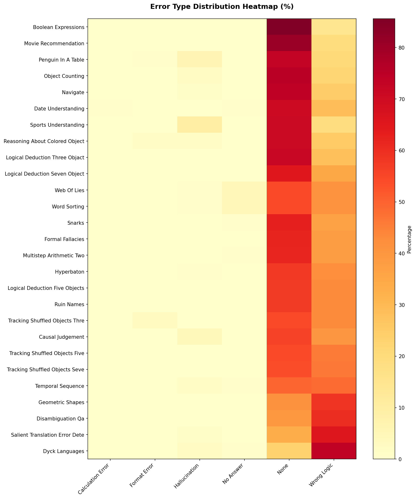

# LLM Judge Analysis Report: Gemini Pro 3 Preview on BBH

**Generated:** 2025-12-27 14:18:44

---

## Executive Summary

| Metric | Value |
|--------|-------|
| **Total Tasks Analyzed** | 27 |
| **Total Samples** | 6,510 |
| **Overall Accuracy** | 60.1% (3,911/6,510) |
| **Best Performing Task** | Boolean Expressions (85.6%) |
| **Worst Performing Task** | Dyck Languages (16.1%) |

### Key Findings

1. **`wrong_logic` is the dominant error type** at 38.8% of all samples
2. **Strong correlation between accuracy and reasoning scores** - high accuracy tasks average ≥4.0 reasoning score
3. **Task difficulty varies significantly** - 16.1% to 85.6% accuracy range

> [!IMPORTANT]
> The model demonstrates consistent reasoning structure but makes logical/computational errors in ~39% of cases.

---

## Visualizations

### Task Accuracy Chart

### Error Distribution

### Reasoning Score Distribution

### Accuracy vs Reasoning Score

### Error Type Heatmap

---

## Task Performance Details

### All Tasks (Sorted by Accuracy)

| Rank | Task | Total | Correct | Accuracy | Avg Score |
|------|------|-------|---------|----------|-----------|
| 1 | Boolean Expressions | 250 | 214 | 🟢 85.6% | 4.57 |
| 2 | Movie Recommendation | 250 | 202 | 🟢 80.8% | 4.44 |
| 3 | Penguin In A Table | 146 | 110 | 🟢 75.3% | 4.13 |
| 4 | Object Counting | 250 | 188 | 🟢 75.2% | 4.28 |
| 5 | Navigate | 250 | 185 | 🟢 74.0% | 4.18 |
| 6 | Date Understanding | 250 | 180 | 🟢 72.0% | 4.00 |
| 7 | Sports Understanding | 250 | 178 | 🟢 71.2% | 4.21 |
| 8 | Reasoning About Colored Objects | 250 | 175 | 🟢 70.0% | 4.16 |
| 9 | Logical Deduction Three Objact | 250 | 174 | 🟡 69.6% | 4.19 |
| 10 | Logical Deduction Seven Objects | 250 | 163 | 🟡 65.2% | 3.96 |
| 11 | Web Of Lies | 250 | 163 | 🟡 65.2% | 3.72 |
| 12 | Word Sorting | 250 | 162 | 🟡 64.8% | 3.72 |
| 13 | Snarks | 178 | 112 | 🟡 62.9% | 3.72 |
| 14 | Formal Fallacies | 250 | 155 | 🟡 62.0% | 3.48 |
| 15 | Multistep Arithmetic Two | 250 | 154 | 🟡 61.6% | 4.42 |
| 16 | Hyperbaton | 250 | 144 | 🟡 57.6% | 3.31 |
| 17 | Logical Deduction Five Objects | 250 | 143 | 🟡 57.2% | 3.71 |
| 18 | Ruin Names | 250 | 143 | 🟡 57.2% | 3.32 |
| 19 | Tracking Shuffled Objects Three Objects | 250 | 143 | 🟡 57.2% | 3.60 |
| 20 | Causal Judgement | 187 | 104 | 🟡 55.6% | 3.62 |
| 21 | Tracking Shuffled Objects Five Objects | 250 | 136 | 🟡 54.4% | 3.18 |
| 22 | Tracking Shuffled Objects Seven Objects | 250 | 134 | 🟡 53.6% | 3.10 |
| 23 | Temporal Sequence | 250 | 124 | 🔴 49.6% | 2.98 |
| 24 | Geometric Shapes | 250 | 103 | 🔴 41.2% | 2.65 |
| 25 | Disambiguation Qa | 250 | 99 | 🔴 39.6% | 3.22 |
| 26 | Salient Translation Error Detection | 250 | 83 | 🔴 33.2% | 3.03 |
| 27 | Dyck Languages | 249 | 40 | 🔴 16.1% | 2.41 |

---

## Error Analysis

### Global Error Distribution

| Error Type | Count | Percentage |
|------------|-------|------------|
| `none` | 3,869 | 59.4% |
| `wrong_logic` | 2,529 | 38.8% |
| `hallucination` | 71 | 1.1% |
| `no_answer` | 27 | 0.4% |
| `format_error` | 13 | 0.2% |
| `calculation_error` | 1 | 0.0% |

### Reasoning Score Distribution

| Score | Count | Percentage | Interpretation |
|-------|-------|------------|----------------|
| 5 | 3,774 | 58.0% | Perfect logic |
| 4 | 168 | 2.6% | Minor issues |
| 3 | 224 | 3.4% | Moderate errors |
| 2 | 1,339 | 20.6% | Significant errors |
| 1 | 1,005 | 15.4% | Fundamental failure |

---

## Per-Task Error Breakdown

### Boolean Expressions

- **Accuracy:** 85.6% (214/250)
- **Avg Reasoning Score:** 4.57
- **Error Types:** `none`: 214, `wrong_logic`: 36

### Movie Recommendation

- **Accuracy:** 80.8% (202/250)
- **Avg Reasoning Score:** 4.44
- **Error Types:** `none`: 202, `wrong_logic`: 48

### Penguin In A Table

- **Accuracy:** 75.3% (110/146)
- **Avg Reasoning Score:** 4.13
- **Error Types:** `none`: 106, `wrong_logic`: 30, `hallucination`: 9, `format_error`: 1

### Object Counting

- **Accuracy:** 75.2% (188/250)
- **Avg Reasoning Score:** 4.28
- **Error Types:** `none`: 188, `wrong_logic`: 56, `hallucination`: 6

### Navigate

- **Accuracy:** 74.0% (185/250)
- **Avg Reasoning Score:** 4.18
- **Error Types:** `none`: 185, `wrong_logic`: 62, `hallucination`: 3

### Date Understanding

- **Accuracy:** 72.0% (180/250)
- **Avg Reasoning Score:** 4.00
- **Error Types:** `none`: 176, `wrong_logic`: 72, `calculation_error`: 1, `no_answer`: 1

### Sports Understanding

- **Accuracy:** 71.2% (178/250)
- **Avg Reasoning Score:** 4.21
- **Error Types:** `none`: 178, `wrong_logic`: 47, `hallucination`: 25

### Reasoning About Colored Objects

- **Accuracy:** 70.0% (175/250)
- **Avg Reasoning Score:** 4.16
- **Error Types:** `none`: 178, `wrong_logic`: 63, `format_error`: 5, `hallucination`: 4

### Logical Deduction Three Objact

- **Accuracy:** 69.6% (174/250)
- **Avg Reasoning Score:** 4.19
- **Error Types:** `none`: 179, `wrong_logic`: 71

### Logical Deduction Seven Objects

- **Accuracy:** 65.2% (163/250)
- **Avg Reasoning Score:** 3.96
- **Error Types:** `none`: 163, `wrong_logic`: 87

### Web Of Lies

- **Accuracy:** 65.2% (163/250)
- **Avg Reasoning Score:** 3.72
- **Error Types:** `none`: 136, `wrong_logic`: 102, `no_answer`: 11, `hallucination`: 1

### Word Sorting

- **Accuracy:** 64.8% (162/250)
- **Avg Reasoning Score:** 3.72
- **Error Types:** `none`: 136, `wrong_logic`: 102, `no_answer`: 11, `hallucination`: 1

### Snarks

- **Accuracy:** 62.9% (112/178)
- **Avg Reasoning Score:** 3.72
- **Error Types:** `none`: 112, `wrong_logic`: 65, `no_answer`: 1

### Formal Fallacies

- **Accuracy:** 62.0% (155/250)
- **Avg Reasoning Score:** 3.48
- **Error Types:** `none`: 155, `wrong_logic`: 95

### Multistep Arithmetic Two

- **Accuracy:** 61.6% (154/250)
- **Avg Reasoning Score:** 4.42
- **Error Types:** `none`: 154, `wrong_logic`: 95, `no_answer`: 1

### Hyperbaton

- **Accuracy:** 57.6% (144/250)
- **Avg Reasoning Score:** 3.31
- **Error Types:** `none`: 144, `wrong_logic`: 105, `hallucination`: 1

### Logical Deduction Five Objects

- **Accuracy:** 57.2% (143/250)
- **Avg Reasoning Score:** 3.71
- **Error Types:** `none`: 143, `wrong_logic`: 107

### Ruin Names

- **Accuracy:** 57.2% (143/250)
- **Avg Reasoning Score:** 3.32
- **Error Types:** `none`: 143, `wrong_logic`: 107

### Tracking Shuffled Objects Three Objects

- **Accuracy:** 57.2% (143/250)
- **Avg Reasoning Score:** 3.60
- **Error Types:** `none`: 136, `wrong_logic`: 107, `format_error`: 7

### Causal Judgement

- **Accuracy:** 55.6% (104/187)
- **Avg Reasoning Score:** 3.62
- **Error Types:** `none`: 104, `wrong_logic`: 75, `hallucination`: 8

### Tracking Shuffled Objects Five Objects

- **Accuracy:** 54.4% (136/250)
- **Avg Reasoning Score:** 3.18
- **Error Types:** `none`: 136, `wrong_logic`: 114

### Tracking Shuffled Objects Seven Objects

- **Accuracy:** 53.6% (134/250)
- **Avg Reasoning Score:** 3.10
- **Error Types:** `none`: 134, `wrong_logic`: 116

### Temporal Sequence

- **Accuracy:** 49.6% (124/250)
- **Avg Reasoning Score:** 2.98
- **Error Types:** `none`: 124, `wrong_logic`: 121, `hallucination`: 4, `no_answer`: 1

### Geometric Shapes

- **Accuracy:** 41.2% (103/250)
- **Avg Reasoning Score:** 2.65
- **Error Types:** `wrong_logic`: 147, `none`: 103

### Disambiguation Qa

- **Accuracy:** 39.6% (99/250)
- **Avg Reasoning Score:** 3.22
- **Error Types:** `wrong_logic`: 151, `none`: 99

### Salient Translation Error Detection

- **Accuracy:** 33.2% (83/250)
- **Avg Reasoning Score:** 3.03
- **Error Types:** `wrong_logic`: 164, `none`: 83, `hallucination`: 3

### Dyck Languages

- **Accuracy:** 16.1% (40/249)
- **Avg Reasoning Score:** 2.41
- **Error Types:** `wrong_logic`: 184, `none`: 58, `hallucination`: 6, `no_answer`: 1

---

## Sample Cases

Below are randomly sampled correct and incorrect cases from select tasks.

### Dyck Languages

**Incorrect Cases:**

- **ID 229**: Answer=`[ < { < ( ( ) ) ) > } >`, Score=2, Error=`wrong_logic`
  - *Model added `] }`. GT is `] }`. Correct.*
- **ID 108**: Answer=`< { < ( ) ) ) )`, Score=1, Error=`wrong_logic`
  - *Model modified structure.*

**Correct Cases:**

- **ID 71**: Answer=`{ [ < [ < { < { } > } > ( ( < { [ ] } > { { } } ) { } ) ] > ] }`, Score=5`
- **ID 19**: Answer=`( ( ) ) [ { ( < > ) } ]`, Score=5`

### Salient Translation Error Detection

**Incorrect Cases:**

- **ID 180**: Answer=`A`, Score=2, Error=`wrong_logic`
  - *The translation changed 'kleines' (small) to 'big'. This is an Antonym error (C). Model selected (A).*
- **ID 90**: Answer=`D`, Score=2, Error=`wrong_logic`
  - *The translation changed 'deutsche' to 'French'. This is a Modifier/Adjective error (A). Model selected (D).*

**Correct Cases:**

- **ID 99**: Answer=`B`, Score=5`
- **ID 153**: Answer=`E`, Score=5`

### Boolean Expressions

**Incorrect Cases:**

- **ID 178**: Answer=`True`, Score=2, Error=`wrong_logic`
  - *Precedence error. `True and (not not False) and (not False)`. `True and False and True` -> False. Model got True.*
- **ID 222**: Answer=`True`, Score=2, Error=`wrong_logic`
  - *Precedence error. `False or ((not False) and False)`. `True and False` is False. `False or False` is False. Model said True.*

**Correct Cases:**

- **ID 82**: Answer=`True`, Score=5`
- **ID 155**: Answer=`False`, Score=5`

---

## Methodology

### LLM Judge Configuration

The evaluation was performed using **Gemini Pro 3 Preview** as an LLM-as-Judge with the following approach:

1. **Semantic Matching**: Prioritizes the semantic meaning of the final conclusion over strict formatting
2. **Answer Extraction**: Ignores `<think>` traces, focuses on final response text
3. **Equivalence Rules**: Maps various answer formats to ground truth:
   - Multiple Choice: `(A)` ≡ `A`, `Option A`, `[A]`, `\boxed{A}`
   - Boolean: `True` ≡ `true`, `yes`, `valid`; `False` ≡ `false`, `no`, `invalid`
   - Plausibility: `yes` ≡ `plausible`; `no` ≡ `implausible`

### Scoring Rubric

| Score | Meaning |
|-------|---------|
| 5 | Perfect logic and correct answer |
| 4 | Minor issues in reasoning |
| 3 | Moderate errors |
| 2 | Significant logical errors |
| 1 | Fundamental failure in reasoning |

### Error Types

| Type | Description |
|------|-------------|
| `none` | No error (correct answer) |
| `wrong_logic` | Correct reasoning structure but logical/computational error |
| `hallucination` | Model fabricated information |
| `format_error` | Answer format could not be parsed |
| `no_answer` | Model did not provide a clear answer |
| `calculation_error` | Arithmetic/computational mistake |

---

*Report generated by `comprehensive_llm_judge_analyzer.py`*