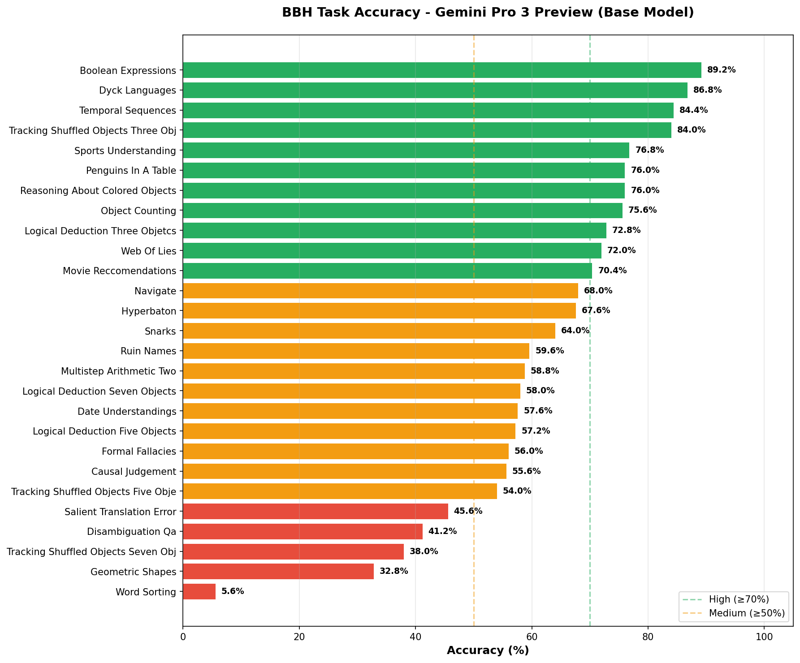
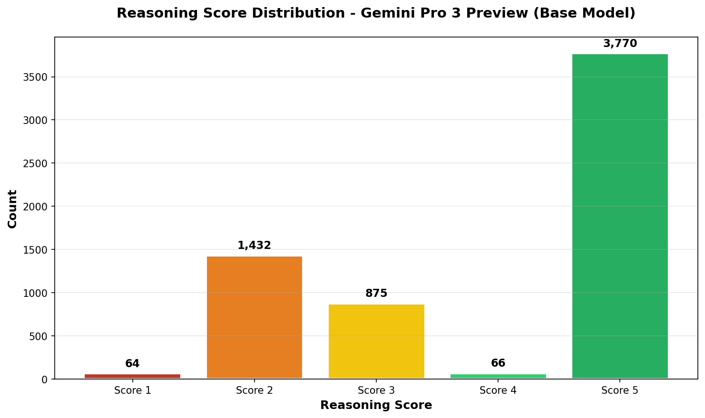
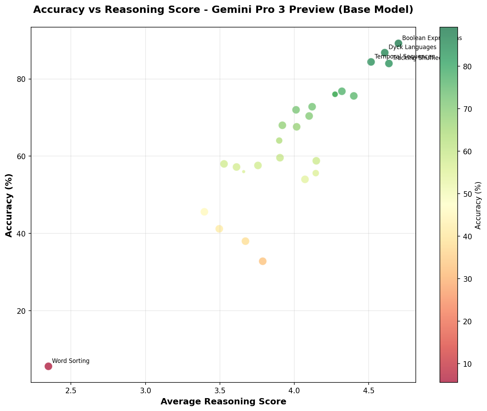
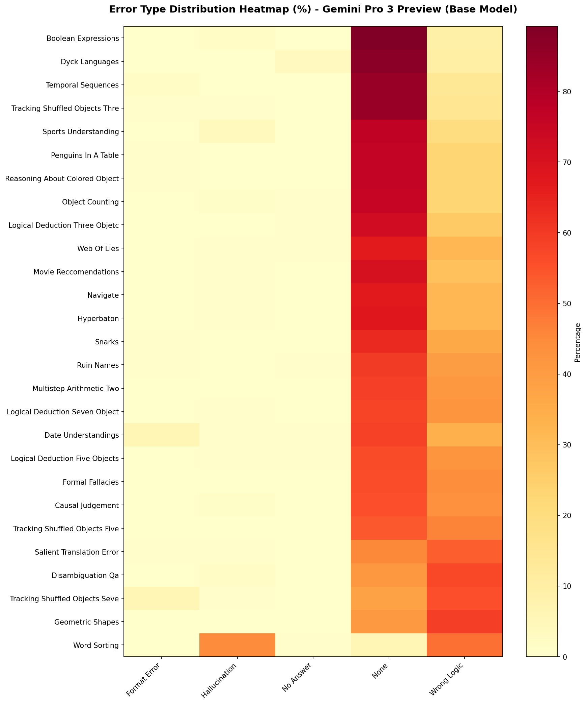

# LLM Judge Analysis Report: Gemini Pro 3 Preview (Base Model) on BBH

**Generated:** 2026-01-09 19:06:35

> [!NOTE]
> This report analyzes the **BASE MODEL** (without finetuning) results for comparison purposes.

---

## Executive Summary

| Metric                    | Value                             |
| ------------------------- | --------------------------------- |
| **Model**                 | Gemini Pro 3 Preview (Base Model) |
| **Total Tasks Analyzed**  | 27                                |
| **Total Samples**         | 6,207                             |
| **Overall Accuracy**      | 62.2% (3,858/6,207)               |
| **Best Performing Task**  | Boolean Expressions (89.2%)       |
| **Worst Performing Task** | Word Sorting (5.6%)               |

### Key Findings

1. **`wrong_logic` is the dominant error type** at 34.4% of all samples
2. **Strong correlation between accuracy and reasoning scores** - high accuracy tasks average ≥4.0 reasoning score
3. **Task difficulty varies significantly** - 5.6% to 89.2% accuracy range

> [!IMPORTANT]
> The base model demonstrates consistent reasoning structure but makes logical/computational errors in ~34% of cases.

---

## Visualizations

### Task Accuracy Chart

### Error Distribution

### Reasoning Score Distribution

### Accuracy vs Reasoning Score

### Error Type Heatmap

---

## Task Performance Details

### All Tasks (Sorted by Accuracy)

| Rank | Task                                    | Total | Correct | Accuracy | Avg Score |
| ---- | --------------------------------------- | ----- | ------- | -------- | --------- |
| 1    | Boolean Expressions                     | 250   | 223     | 🟢 89.2%  | 4.70      |
| 2    | Dyck Languages                          | 250   | 217     | 🟢 86.8%  | 4.61      |
| 3    | Temporal Sequences                      | 250   | 211     | 🟢 84.4%  | 4.52      |
| 4    | Tracking Shuffled Objects Three Objects | 250   | 210     | 🟢 84.0%  | 4.64      |
| 5    | Sports Understanding                    | 250   | 192     | 🟢 76.8%  | 4.32      |
| 6    | Penguins In A Table                     | 146   | 111     | 🟢 76.0%  | 4.27      |
| 7    | Reasoning About Colored Objects         | 146   | 111     | 🟢 76.0%  | 4.27      |
| 8    | Object Counting                         | 250   | 189     | 🟢 75.6%  | 4.40      |
| 9    | Logical Deduction Three Objetcs         | 250   | 182     | 🟢 72.8%  | 4.12      |
| 10   | Web Of Lies                             | 250   | 180     | 🟢 72.0%  | 4.01      |
| 11   | Movie Reccomendations                   | 250   | 176     | 🟢 70.4%  | 4.10      |
| 12   | Navigate                                | 250   | 170     | 🟡 68.0%  | 3.92      |
| 13   | Hyperbaton                              | 250   | 169     | 🟡 67.6%  | 4.02      |
| 14   | Snarks                                  | 178   | 114     | 🟡 64.0%  | 3.90      |
| 15   | Ruin Names                              | 250   | 149     | 🟡 59.6%  | 3.90      |
| 16   | Multistep Arithmetic Two                | 250   | 147     | 🟡 58.8%  | 4.15      |
| 17   | Logical Deduction Seven Objects         | 250   | 145     | 🟡 58.0%  | 3.53      |
| 18   | Date Understandings                     | 250   | 144     | 🟡 57.6%  | 3.76      |
| 19   | Logical Deduction Five Objects          | 250   | 143     | 🟡 57.2%  | 3.61      |
| 20   | Formal Fallacies                        | 50    | 28      | 🟡 56.0%  | 3.66      |
| 21   | Causal Judgement                        | 187   | 104     | 🟡 55.6%  | 4.14      |
| 22   | Tracking Shuffled Objects Five Objects  | 250   | 135     | 🟡 54.0%  | 4.07      |
| 23   | Salient Translation Error               | 250   | 114     | 🔴 45.6%  | 3.40      |
| 24   | Disambiguation Qa                       | 250   | 103     | 🔴 41.2%  | 3.50      |
| 25   | Tracking Shuffled Objects Seven Objects | 250   | 95      | 🔴 38.0%  | 3.67      |
| 26   | Geometric Shapes                        | 250   | 82      | 🔴 32.8%  | 3.79      |
| 27   | Word Sorting                            | 250   | 14      | 🔴 5.6%   | 2.35      |

---

## Error Analysis

### Global Error Distribution

| Error Type      | Count | Percentage |
| --------------- | ----- | ---------- |
| `none`          | 3,862 | 62.2%      |
| `wrong_logic`   | 2,138 | 34.4%      |
| `hallucination` | 148   | 2.4%       |
| `format_error`  | 41    | 0.7%       |
| `no_answer`     | 18    | 0.3%       |

### Reasoning Score Distribution

| Score | Count | Percentage | Interpretation      |
| ----- | ----- | ---------- | ------------------- |
| 5     | 3,770 | 60.7%      | Perfect logic       |
| 4     | 66    | 1.1%       | Minor issues        |
| 3     | 875   | 14.1%      | Moderate errors     |
| 2     | 1,432 | 23.1%      | Significant errors  |
| 1     | 64    | 1.0%       | Fundamental failure |

---

## Per-Task Error Breakdown

### Boolean Expressions

- **Accuracy:** 89.2% (223/250)
- **Avg Reasoning Score:** 4.70
- **Error Types:** `none`: 223, `wrong_logic`: 23, `hallucination`: 4

### Dyck Languages

- **Accuracy:** 86.8% (217/250)
- **Avg Reasoning Score:** 4.61
- **Error Types:** `none`: 217, `wrong_logic`: 25, `no_answer`: 8

### Temporal Sequences

- **Accuracy:** 84.4% (211/250)
- **Avg Reasoning Score:** 4.52
- **Error Types:** `none`: 211, `wrong_logic`: 35, `format_error`: 4

### Tracking Shuffled Objects Three Objects

- **Accuracy:** 84.0% (210/250)
- **Avg Reasoning Score:** 4.64
- **Error Types:** `none`: 211, `wrong_logic`: 37, `hallucination`: 1, `format_error`: 1

### Sports Understanding

- **Accuracy:** 76.8% (192/250)
- **Avg Reasoning Score:** 4.32
- **Error Types:** `none`: 192, `wrong_logic`: 49, `hallucination`: 9

### Penguins In A Table

- **Accuracy:** 76.0% (111/146)
- **Avg Reasoning Score:** 4.27
- **Error Types:** `none`: 111, `wrong_logic`: 34, `format_error`: 1

### Reasoning About Colored Objects

- **Accuracy:** 76.0% (111/146)
- **Avg Reasoning Score:** 4.27
- **Error Types:** `none`: 111, `wrong_logic`: 34, `format_error`: 1

### Object Counting

- **Accuracy:** 75.6% (189/250)
- **Avg Reasoning Score:** 4.40
- **Error Types:** `none`: 189, `wrong_logic`: 57, `hallucination`: 3, `no_answer`: 1

### Logical Deduction Three Objetcs

- **Accuracy:** 72.8% (182/250)
- **Avg Reasoning Score:** 4.12
- **Error Types:** `none`: 182, `wrong_logic`: 67, `no_answer`: 1

### Web Of Lies

- **Accuracy:** 72.0% (180/250)
- **Avg Reasoning Score:** 4.01
- **Error Types:** `none`: 167, `wrong_logic`: 80, `no_answer`: 2, `hallucination`: 1

### Movie Reccomendations

- **Accuracy:** 70.4% (176/250)
- **Avg Reasoning Score:** 4.10
- **Error Types:** `none`: 176, `wrong_logic`: 73, `hallucination`: 1

### Navigate

- **Accuracy:** 68.0% (170/250)
- **Avg Reasoning Score:** 3.92
- **Error Types:** `none`: 168, `wrong_logic`: 80, `hallucination`: 2

### Hyperbaton

- **Accuracy:** 67.6% (169/250)
- **Avg Reasoning Score:** 4.02
- **Error Types:** `none`: 169, `wrong_logic`: 80, `hallucination`: 1

### Snarks

- **Accuracy:** 64.0% (114/178)
- **Avg Reasoning Score:** 3.90
- **Error Types:** `none`: 113, `wrong_logic`: 64, `format_error`: 1

### Ruin Names

- **Accuracy:** 59.6% (149/250)
- **Avg Reasoning Score:** 3.90
- **Error Types:** `none`: 149, `wrong_logic`: 99, `no_answer`: 1, `format_error`: 1

### Multistep Arithmetic Two

- **Accuracy:** 58.8% (147/250)
- **Avg Reasoning Score:** 4.15
- **Error Types:** `none`: 147, `wrong_logic`: 103

### Logical Deduction Seven Objects

- **Accuracy:** 58.0% (145/250)
- **Avg Reasoning Score:** 3.53
- **Error Types:** `none`: 144, `wrong_logic`: 105, `hallucination`: 1

### Date Understandings

- **Accuracy:** 57.6% (144/250)
- **Avg Reasoning Score:** 3.76
- **Error Types:** `none`: 146, `wrong_logic`: 85, `format_error`: 15, `no_answer`: 2, `hallucination`: 2

### Logical Deduction Five Objects

- **Accuracy:** 57.2% (143/250)
- **Avg Reasoning Score:** 3.61
- **Error Types:** `none`: 141, `wrong_logic`: 105, `hallucination`: 2, `no_answer`: 2

### Formal Fallacies

- **Accuracy:** 56.0% (28/50)
- **Avg Reasoning Score:** 3.66
- **Error Types:** `none`: 28, `wrong_logic`: 22

### Causal Judgement

- **Accuracy:** 55.6% (104/187)
- **Avg Reasoning Score:** 4.14
- **Error Types:** `none`: 104, `wrong_logic`: 81, `hallucination`: 2

### Tracking Shuffled Objects Five Objects

- **Accuracy:** 54.0% (135/250)
- **Avg Reasoning Score:** 4.07
- **Error Types:** `none`: 135, `wrong_logic`: 115

### Salient Translation Error

- **Accuracy:** 45.6% (114/250)
- **Avg Reasoning Score:** 3.40
- **Error Types:** `wrong_logic`: 132, `none`: 114, `hallucination`: 2, `format_error`: 2

### Disambiguation Qa

- **Accuracy:** 41.2% (103/250)
- **Avg Reasoning Score:** 3.50
- **Error Types:** `wrong_logic`: 142, `none`: 103, `hallucination`: 5

### Tracking Shuffled Objects Seven Objects

- **Accuracy:** 38.0% (95/250)
- **Avg Reasoning Score:** 3.67
- **Error Types:** `wrong_logic`: 139, `none`: 95, `format_error`: 15, `hallucination`: 1

### Geometric Shapes

- **Accuracy:** 32.8% (82/250)
- **Avg Reasoning Score:** 3.79
- **Error Types:** `wrong_logic`: 148, `none`: 102

### Word Sorting

- **Accuracy:** 5.6% (14/250)
- **Avg Reasoning Score:** 2.35
- **Error Types:** `wrong_logic`: 124, `hallucination`: 111, `none`: 14, `no_answer`: 1

---

## Sample Cases

Below are randomly sampled correct and incorrect cases from select tasks.

### Word Sorting

**Incorrect Cases:**

- **ID 134**: Answer=`confrontation, daddy, hirsute, List, proserpine, proofread, quantitative`, Score=2, Error=`wrong_logic`
  - *The model included 'List' and sorted 'proserpine' before 'proofread'.*
- **ID 25**: Answer=`croupier, daffy, dockyard, duty, confess, household, hypothesis, info, loam, mandate, mantic, minstrelsy, nepotism, peccary, sawtimber, serenade, silver, summate, triode`, Score=3, Error=`wrong_logic`
  - *The model failed to sort the list correctly (e.g., 'confess' appears after 'duty').*

**Correct Cases:**

- **ID 100**: Answer=`lise, miaow, snipe`, Score=5`
- **ID 120**: Answer=`allegoric, collate, euphony, gloriana, loge, lollipop, mast, milord, prolix, rendezvous, salle, schnabel`, Score=5`

### Geometric Shapes

**Incorrect Cases:**

- **ID 3**: Answer=`(D)`, Score=3, Error=`wrong_logic`
  - *The model correctly identifies the shape as a quadrilateral based on the points but misclassifies it as a kite instead of a trapezoid.*
- **ID 111**: Answer=`(A)`, Score=4, Error=`wrong_logic`
  - *Identifies circular arcs, concludes circle. Ground truth is ellipse.*

**Correct Cases:**

- **ID 233**: Answer=`(J)`, Score=5`
- **ID 23**: Answer=`(G)`, Score=5`

### Boolean Expressions

**Incorrect Cases:**

- **ID 142**: Answer=`False`, Score=2, Error=`wrong_logic`
  - *Precedence error. Evaluated 'False or True' inside an implicit parenthesis grouping that didn't exist, failing to evaluate 'True and False' first correctly.*
- **ID 135**: Answer=`True`, Score=2, Error=`hallucination`
  - *Massive hallucination of boolean rules. claimed 'False and False' is equivalent to 'not (False or False)'.*

**Correct Cases:**

- **ID 109**: Answer=`False`, Score=5`
- **ID 240**: Answer=`False`, Score=5`

---

## Methodology

### LLM Judge Configuration

The evaluation was performed using **Gemini Pro 3 Preview** as an LLM-as-Judge with the following approach:

1. **Semantic Matching**: Prioritizes the semantic meaning of the final conclusion over strict formatting
2. **Answer Extraction**: Ignores `<think>` traces, focuses on final response text
3. **Equivalence Rules**: Maps various answer formats to ground truth:
   - Multiple Choice: `(A)` ≡ `A`, `Option A`, `[A]`, `\boxed{A}`
   - Boolean: `True` ≡ `true`, `yes`, `valid`; `False` ≡ `false`, `no`, `invalid`
   - Plausibility: `yes` ≡ `plausible`; `no` ≡ `implausible`

### Scoring Rubric

| Score | Meaning                          |
| ----- | -------------------------------- |
| 5     | Perfect logic and correct answer |
| 4     | Minor issues in reasoning        |
| 3     | Moderate errors                  |
| 2     | Significant logical errors       |
| 1     | Fundamental failure in reasoning |

### Error Types

| Type                | Description                                                 |
| ------------------- | ----------------------------------------------------------- |
| `none`              | No error (correct answer)                                   |
| `wrong_logic`       | Correct reasoning structure but logical/computational error |
| `hallucination`     | Model fabricated information                                |
| `format_error`      | Answer format could not be parsed                           |
| `no_answer`         | Model did not provide a clear answer                        |
| `calculation_error` | Arithmetic/computational mistake                            |

---

*Report generated by `comprehensive_llm_judge_analyzer_base.py`*